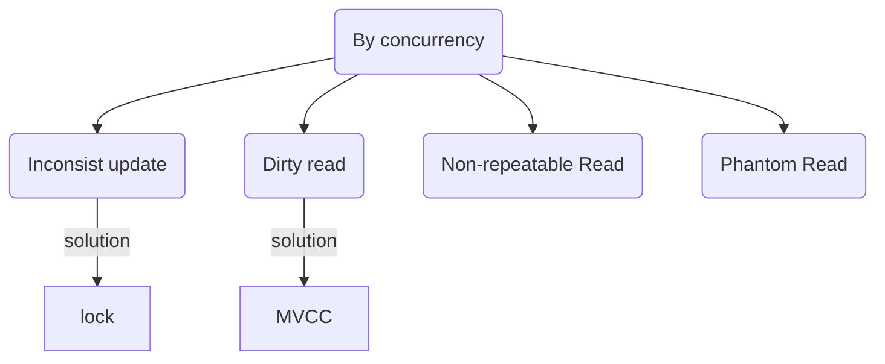

# All About Database


- [JOINS](#joins)
- [Index](#index)
- [Q/A](#qa)

## TO READ

- https://coding.fnsne.com/posts/2022-09-14/%E8%B3%87%E6%96%99%E5%BA%AB%E7%9A%84%E5%90%8C%E6%AD%A5/?fbclid=IwAR03zwbUN7ulTrMgxGTyi9gtHKiD0bvAnBybUVtD5JCI6u1SfU300XCHc18 + google isolation level

## Difficulty of DB Performance

**一致性難題**

- 銀行轉賬問題：
- 投票問題：

---

並行所產生的不一致性難題



- Dirty Read: A transaction reads data written by other concurrent uncommitted transation
- Non-repeatable Read: A transaction reads the same row twice and sees different value becuase it has been modified by other committed transaction
- Phantom Read: A transaction re-executes a query to find rows that satisfy a condition and sees a different set of rows, due to changes by other commited transaction
- Serialization Anomaly: The result of group of concurrent commited transactions is impossible to achieve if we try to run them sequentially in any order without overlapping

## JOINS

- Target: combine rows from two or more tables (based on a related column between them)

### INNER JOIN

- 交集

```sql
-- eg mysql
SELECT * FROM <table_name> INNER JOIN <table_name> ON <col> = <col>
```

### LEFT JOIN

- See all left table but only see matching right table

> The `LEFT JOIN` keyword returns all records from the left table, even if there are no matches in the right table.

```sql
-- eg mysql
SELECT * FROM <table_name> LEFT JOIN <table_name> ON <col> = <col>
```

### FULL OUTER JOIN

Show all matching records

## Index

- Every index has its own B+ tree
  > See [B+ tree](https://github.com/chengr4/my-data-structures/blob/main/tree/README.md#b-tree)
- 每次新增、更新資料時，都會異動到所使用的 b+ tree => 當使用的 index 越多，需要維護的 index 也越多 => 若建立太多 index ，可能會降低新增或者更新的效率
- Use `EXPLAIN` => Eg. `EXPLAIN SELECT * FROM user_no WHERE name = 'mark';`
- If values in a field are too small (eg only 0 and 1), not good to use index 

## Union

- Columns to take from queries should be the same
- MySQL automtically remove duplicate entries => so use `UNION ALL` if you need duplicates

```sql
-- eg mysql
SELECT name, cost, bids FROM items WHERE bids > 190;
UNION
SELECT name, cost, bids FROM items WHERE bids > 190;
```


### When to Use?

- Take same cols from two tables with one single query

## Q/A

Q: What is "transaction"?

A: A SQL transaction is a grouping of one or more SQL statements that interact with a database.

Q: When to use index?

A: 取決於使用者的使用情況。觀察哪種 queries 最頻繁最吃 resource ，再考慮值不值得創建索引

Q: What is a database driver?

A: A database driver is a software component that enables a software application to communicate with DBMS and perform database operations. A database driver acts as an intermediary between the application and the DBMS, translating the API calls made by the application into a format that the DBMS can understand and execute.

Eg. Oracle JDBC driver for Java, pq for Golang

Q: How tow avoid dead lock?

1. `FOR NO KEY UPDATE;`
    ```sql
    SELECT * FROM account
    WHERE id = $1
    LIMIT 1
    FOR NO KEY UPDATE; <!-- Not update the key or ID of the column => Not affect foreign key of other table  -->
    ```
2. update data in a consistent order (eg small ID first)

## Cheat Sheet

## DB Design Tool

- https://dbdiagram.io/home?fbclid=IwAR1aOLukZTXPT68SNAYa1j6zd1cNIQ8DXWzhh9kCsFG7UdnGQeo_y2ZnUyM

## References

- [MySQL Database Tutorial - 24 - UNION (2012.01)](https://youtu.be/crj8x1PevcY)
- [116. Populating Next Right Pointers in Each Node](https://leetcode.com/problems/populating-next-right-pointers-in-each-node/)
