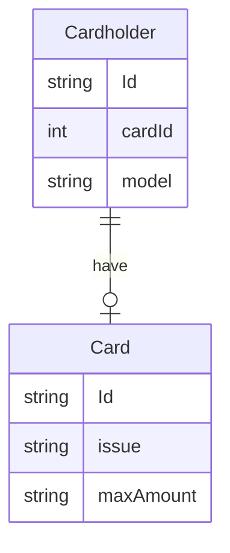

# Notes

| Terms| Description |
| ---- | ----------- |
| Entity | eg student (A table should be about on entity) |
| Attribute | eg student name, address |

## Relationships

Break big table to smaller tables and make relationships

### One to One

E.g husband and wife, Soical Security number (SSN) and American

- We can often store one to one relationshp as **attribute** rather than entities

> **Note**  
> There will be occasional times when we store a one to one relationship over multiple tables

E.g.

Therefore, the way to store 1:1 relationship is
  1. attrible within the table
  2. another table (can use foreign to connect them)

### One to Many

### Many to Many

E.g class and student

## Finished Topics

### Database Design Course

- [x] Relationships
- [x] One to One Relationships + Design
- [x] One to Many Relationships
- [x] Many yo Many Relationships

## References

1. [Caleb Curry; Database Design Course - Learn how to design and plan a database for beginners (2018.8)](https://youtu.be/ztHopE5Wnpc)
