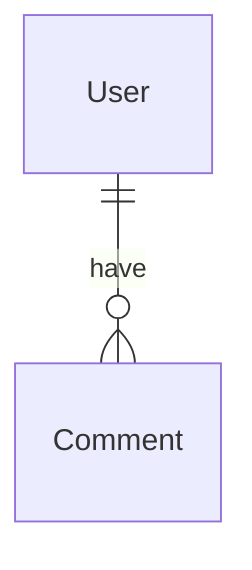

# Notes

| Terms| Description |
| ---- | ----------- |
| Entity | eg student (A table should be about on entity) |
| Attribute | eg student name, address |

## Relationships

- Break big table to smaller tables and make relationships
- To know relationship between parent table and child table are important
    - primary key goes on parent and foreign key goes on child


### One to One

> Bi-direction that target table and current table point to each other

E.g husband and wife, Soical Security number (SSN) and American

- We can often store one to one relationshp as **attribute** rather than entities

> **Note**  
> There will be occasional times when we store a one to one relationship over multiple tables

E.g.


Therefore, the way to store 1:1 relationship is
  1. attrible within the table
  2. another table (can use foreign key to connect them)

### One to Many

> One direction to point target table from current table



### Many to Many

E.g class and student

- Need an inter-mediary table (junction table)

```mermaid
erDiagram
  CLASS ||--|{ classStudent: junction
  Student ||--|{ classStudent: junction
```

## Indices

An index is a data structure that you build and assign on top of existing table
and analyze it and summerize it so that it can create a shortcut

- b-tree, and ???-tree

> The B-tree generalizes(概括) the binary search tree, allowing for nodes with more than two children.

```sql
create index employees_name on employees(name);
```

- Clustered:
- Non-clustered: 

> We can only choose one of these two

### Clustered

### Non-clustered

### 

## Finished Topics

### Database Design Course

- [x] Relationships
- [x] One to One Relationships + Design
- [x] One to Many Relationships + Design
- [x] Many yo Many Relationships + Design
- [ ] Indices

## References

1. [Caleb Curry; Database Design Course - Learn how to design and plan a database for beginners (2018.8)](https://youtu.be/ztHopE5Wnpc)
