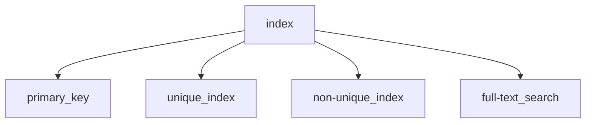

# Index


```mermaid
flowchart TD
index --> primary_key
index --> unique_index
index --> non-unique_index
index --> full-text_search
```

eg

```sql
CREATE UNIQUE INDEX ssn on students (ssn);
```

## References

- [8.3.1 How MySQL Uses Indexes](https://dev.mysql.com/doc/refman/8.0/en/mysql-indexes.html)
